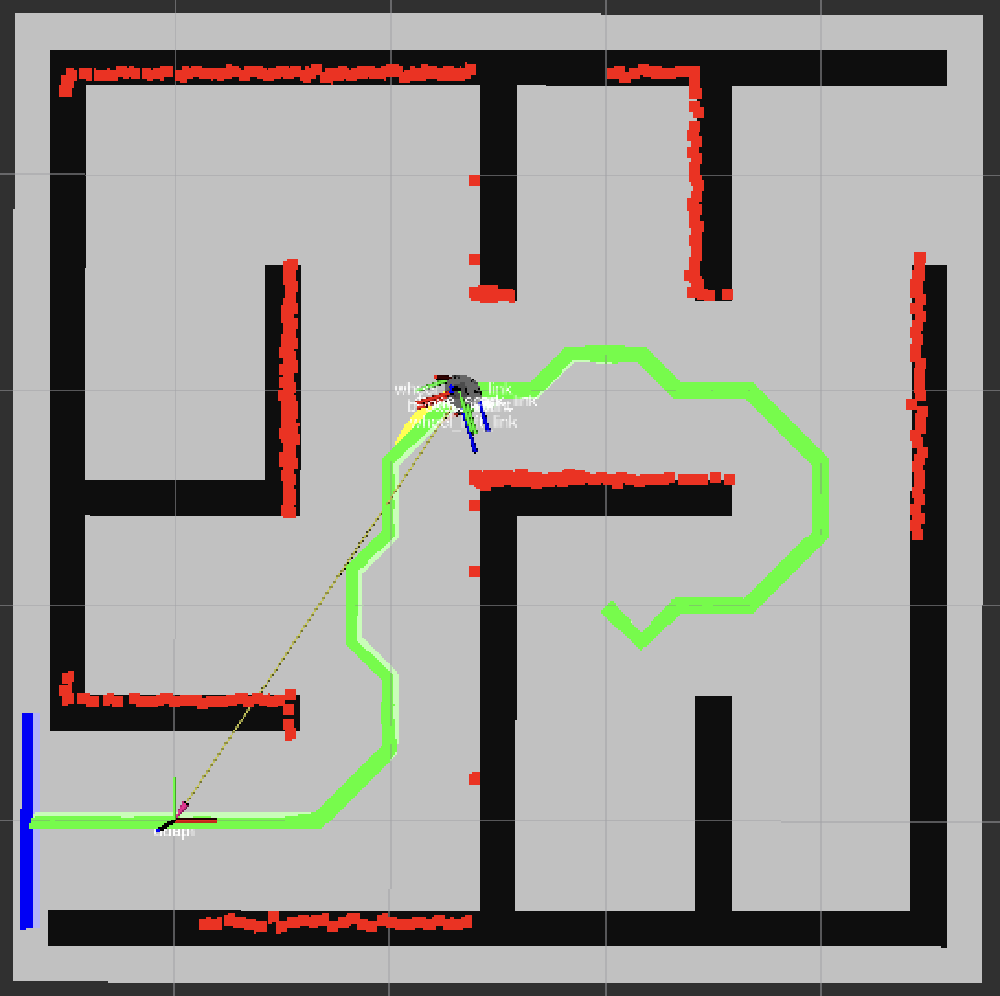

# Robotics Maze Escape



## Introduction

This project implements a maze escape algorithm for a mobile robot using the Robot Operating System (ROS). The robot is equipped with a laser scanner, and it uses several search algorithm to find the shortest path to the goal while avoiding obstacles. The project also includes a simulation environment using Gazebo and RViz.

All of the code is written in Python, and it is designed to be modular and easy to understand. The project is structured in a way that allows for easy extension and modification.

## Features

The project resolves the three main aspects of a robotics maze escape problem:

1. **Localization**: The robot uses a laser scanner to detect obstacles and determine its position in the maze.

2. **Global Path Planning**: The robot uses a search algorithm to find the shortest path to the goal while avoiding obstacles. The algorithms implemented include:

   - Breadth-First Search (BFS)
   - Depth-First Search (DFS)
   - Dijkstra's Algorithm
   - A* Search Algorithm, with the following heuristics:
        - Manhattan Distance
        - Euclidean Distance

3. **Local Path Planning**: The robot uses a local path planning algorithm to navigate through the maze and follow the global path. The local path planning algorithm is based on forward simulation. This algorithm is in charge of sending velocity commands to the robot.

## Running the Project

To run the project, Python3 and ROS v1 (Noetic) is needed. The project relies on the Python package `rospy` and other packages which are installed with ROS. Moreover, the project uses several Python packages, that can be installed using `pip`:

```bash
pip install -r requirements.txt
```

To run the project, once it's downloaded and indexed by ROS, use the following command:

```bash
roslaunch robotics-maze-escape launch_simulation.launch \
    enable_plotting:=<true | false> \
    goal:=<1 | 2> \
    global_planner_algorithm:=<bfs | dfs | astar | dijkstra> \
    global_planner_heuristic:=<manhattan | euclidean> \
```

The `global_planner_heuristic` parameter is only used if the `global_planner_algorithm` is set to `astar`. The `goal` parameter allows you to choose between two different goals in the maze, `1` refering to the bottom left corner and `2` to the top right corner. The `enable_plotting` parameter allows you to enable or disable plotting using Matplotlib.

Once the simulation is running, you can visualize the robot's position and the maze in RViz. The robot will start navigating through the maze, following the global path and avoiding obstacles.

## Documentation

The project is documented using Python docstrings. You can find the documentation in the `docs` folder, as a navigable HTML page. Simply open `docs/index.html` in your web browser to view the documentation.

To generate the documentation, the following command can be used:

```bash
PYTHONPATH=${PYTHONPATH}:./src pdoc src -o ./docs --docformat google
```

## Final Remarks

This project was done in an academic environment, as part of the curriculum of **Mobile Robotics** and **Service and Object-Oriented Algorithms in Robotics** from **University of Applied Sciences Technikum Wien (UASTW)**. The project was carried out by:

* [Alejo Flores Lucey](https://github.com/alejofl) (ID: if24x390)
* [Mauro Leandro Baez](https://github.com/mauritobaez) (ID: se24m502)